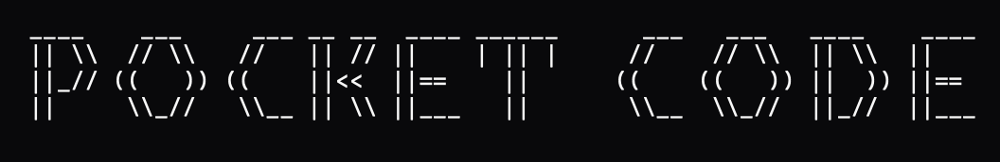

<p align="center">
  
</p>

# 📱 PocketCode

**Build apps using AI right from your Android phone.**

> Works with **OpenCode**, **Claude Code**, **Codex**, and **Gemini CLI**.  
> This guide uses [OpenCode](https://opencode.ai).

---

## What You Need

- Android phone (6GB+ RAM, 5GB free storage)
- [Termux](https://play.google.com/store/apps/details?id=com.termux) from Play Store

---

## Setup (One Time)

Open Termux and run each block:

**1. Update Termux**
```
pkg update -y && pkg upgrade -y
```

**2. Install Linux**
```
pkg install proot-distro -y
proot-distro install debian
```

**3. Enter Linux**
```
proot-distro login debian
```
*(Your prompt should show `root@localhost`)*

**4. Install Tools**
```
apt update && apt install curl git build-essential python3 -y
curl -fsSL https://deb.nodesource.com/setup_20.x | bash -
apt install nodejs -y
```

**5. Install OpenCode**
```
npm install -g opencode-ai --ignore-scripts --omit=dev
cd $(npm root -g)/opencode-ai/node_modules
npm pack opencode-linux-arm64
tar -xvzf opencode-linux-arm64-*.tgz
rm -rf opencode-android-arm64
mv package opencode-android-arm64
rm opencode-linux-arm64-*.tgz
```

**6. Create Shortcut**
```
echo 'alias opencode-web="opencode web --hostname 127.0.0.1 --port 4096"' >> ~/.bashrc
source ~/.bashrc
```

✅ **Done!** Setup complete.

---

## How to Use

Every time you open Termux:

```
proot-distro login debian
```

Then start the AI:

| Mode | Command | Access |
|------|---------|--------|
| Web | `opencode-web` | Chrome → `localhost:4096` |
| Terminal | `opencode` | Direct in Termux |

**Try it:** Tell the AI *"Create a website with a blue background"*

**Preview websites:**
```
cd ~/my-project
python3 -m http.server 8080
```
Then open Chrome → `localhost:8080`

---

## File Management (Optional)

**Using Acode App:**
1. Install [Acode](https://play.google.com/store/apps/details?id=com.foxdebug.acode)
2. Open Acode → Files → Add Path → Termux → home
3. Edit files visually

---

## Saving Your Work

⚠️ **Uninstalling Termux deletes everything.**

**Local Backup:**
```
exit
tar -czvf ~/storage/downloads/pocketcode-backup.tar.gz ~/.proot-distro/
```
*(First run `termux-setup-storage` if prompted)*

**GitHub Sync:**
```
ssh-keygen -t ed25519
cat ~/.ssh/id_ed25519.pub
```
Add the key to [GitHub](https://github.com/settings/keys), then:
```
cd ~/my-project
git init && git add . && git commit -m "save"
git remote add origin git@github.com:YOU/project.git
git push -u origin main
```

---

## Troubleshooting

| Problem | Fix |
|---------|-----|
| "Address already in use" | `pkill node` |
| Commands not found | `source ~/.bashrc` |
| Termux closes randomly | Settings → Apps → Termux → Battery → Unrestricted |

---

**Made with ❤️ for mobile developers.**
